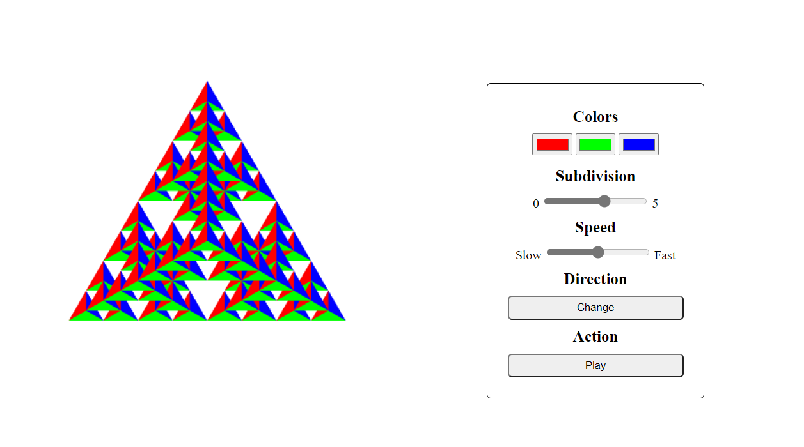

# CPC354-3D Gasket
The program is modified from 3D gasket program in Angel Section 2 (8th Edition) gasket4 and gasket5.

The javascirpt files MVnew.js and initShaders.js are aslo from the source.

A control menu is added to change the gasket's colours, number of subdivision, rotating speed, rotating direction, and action.

